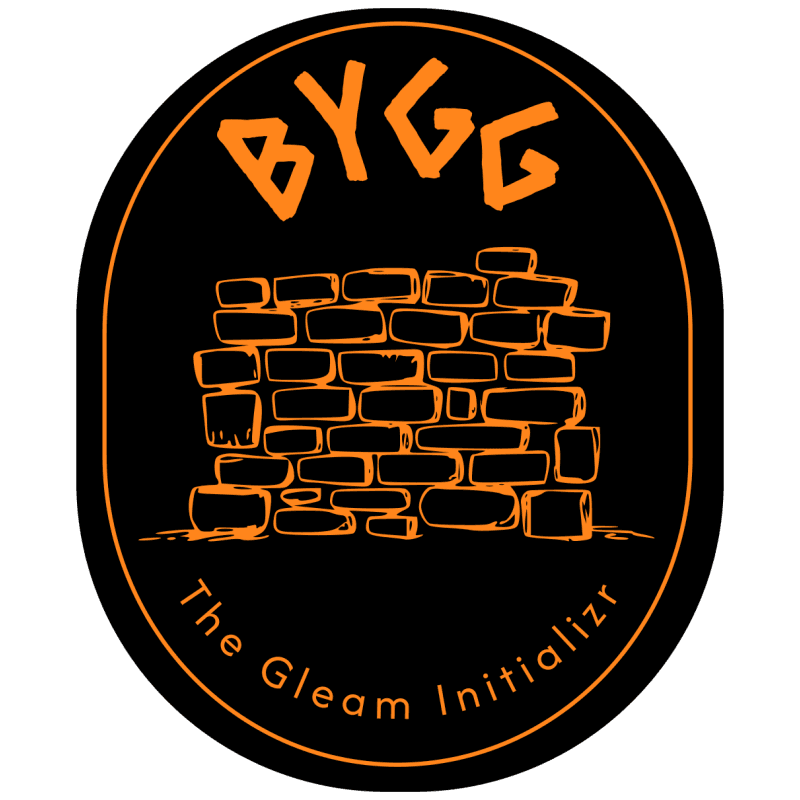

<p align="center">
  
</p>

<p align="center">
  <a href="https://github.com/atomfinger/bygg/actions/workflows/test.yml"></a>
  <a href="https://github.com/atomfinger/bygg/blob/main/LICENSE"></a>
</p>

---

Getting started with Gleam is easy. Getting something production ready is less so, regardless of the language. Bygg aims to help developers getting started by generating projects with sensible defaults already configured and ready to go.

The goal is that you select the kind of application you want to build and the dependencies you want to use. Like a REST api that uses Postgres, or a frontend application using Lustre. Then lett Bygg wire up everything into a cohesive project for you. Spend less time wiring up libraries, and more time building things! 

This project was inspired by the [Spring Initializr](https://start.spring.io/).

## Requirements

- [Gleam](https://gleam.run) >= 1.16.0
- Erlang/OTP >= 26
- [mise](https://mise.jdx.dev) (optional, for task running)

## Usage

### `new`

Scaffold a new Gleam project.

```
bygg new <name> [flags]
```

| Flag | Default | Description |
|---|---|---|
| `--name` | first positional arg | Project name |
| `--version` | `1.0.0` | Package version |
| `--description` | — | Short project description |
| `--target` | `erlang` | Compilation target: `erlang` or `javascript` |
| `--licence` | — | SPDX licence identifier (repeatable) |
| `--gleam` | `>= 1.16.0 and < 2.0.0` | Gleam version constraint |
| `--dep` | — | Runtime dependency by catalog name (repeatable) |
| `--dev-dep` | — | Dev dependency by catalog name (repeatable) |
| `--outdir` | `./<name>` | Output directory |
| `--archetype` | — | Use a predefined archetype (cannot be combined with `--dep`) |

Archetypes are curated presets that bundle a set of deps and a target for common project types. Use `bygg list-archetypes` to see what's available.

**Examples:**

```sh
# REST API using the rest-api archetype
bygg new my_api --archetype=rest-api

# REST API with PostgreSQL and containerised tests, wired up manually
bygg new my_api --dep=wisp,mist,pog,testcontainers_gleam

# Lustre browser SPA (JavaScript target)
bygg new my_spa --archetype=browser-app

# Lustre server component
bygg new my_lsc --dep=lustre_server_component,wisp,mist
```

### `list-archetypes`

List all available archetypes with their descriptions.

```
bygg list-archetypes
```

### `list-deps`

List all packages available in the catalog for a given target.

```
bygg list-deps [--target erlang|javascript]
```

## What You Get

Every generated project includes a `gleam.toml`, a starter `main()`, a passing test, `.gitignore`, and a `README.md` — everything needed to `gleam run` immediately.

Extras are included based on your chosen dependencies:

- **Config** — deps that need typed configuration (e.g. `pog`, `sqlight`) get a `config.gleam` module
- **Context** — web servers and Lustre server components get a `context.gleam` module
- **Environment** — deps with env vars get a `.env.example`
- **Docker** — web apps and deps with services (e.g. `pog`, `franz`) get a `docker-compose.yml` and `Dockerfile`

## Testing

A core goal of Bygg is to generate projects with a robust, working test setup out of the box. 

Add `testcontainers_gleam` as a dev dependency alongside any service dep (Postgres, Kafka, MySQL...) and Bygg will wire up a full containerised test harness:

- A `test_utils.gleam` module with container lifecycle management (`setup` / `stop_containers`)
- Service-specific helper functions (start Postgres, Kafka, etc.) used directly in tests
- Each test gets a fresh container — no shared state, no manual setup

```sh
# Postgres + containerised tests
bygg new my_api --dep=wisp,mist,pog --dev-dep=testcontainers_gleam

# Kafka consumer + containerised tests
bygg new my_consumer --dep=franz --dev-dep=testcontainers_gleam
```

Projects without `testcontainers_gleam` fall back to env-var-based configuration, so the same test code works in both local and CI environments.

## Application Profiles

Bygg detects the intended app type from your chosen dependencies and scaffolds accordingly:

- **Web server** — a [Wisp](https://github.com/gleam-wisp/wisp) + [Mist](https://github.com/rawhat/mist) HTTP server with routing, context, and middleware wired up
- **Browser SPA** — a [Lustre](https://lustre.build) client-side app (JavaScript target) with the full MVU loop
- **Lustre component** — reusable Lustre component boilerplate
- **Lustre server component** — server-rendered Lustre component served over a Wisp/Mist backend

## Monorepo Structure

| Package | Path | Notes |
|---|---|---|
| `core` | `packages/core/` | Catalog, generator, templates, TOML serializer — pure Gleam, both targets |
| `cli` | `packages/cli/` | `glint`-based CLI, `simplifile` output — Erlang target |
| `web` | `packages/web/` | Lustre SPA frontend — planned, not yet implemented |

## Development

```sh
mise run test                     # unit + snapshot tests
mise run integration-test         # ~100 generate/compile scenarios (no Docker)
mise run integration-test-docker  # Docker scenarios (pog, kafka, etc.)
gleam run -m birdie accept        # approve changed snapshots
mise run clean                    # delete build artefacts
```
